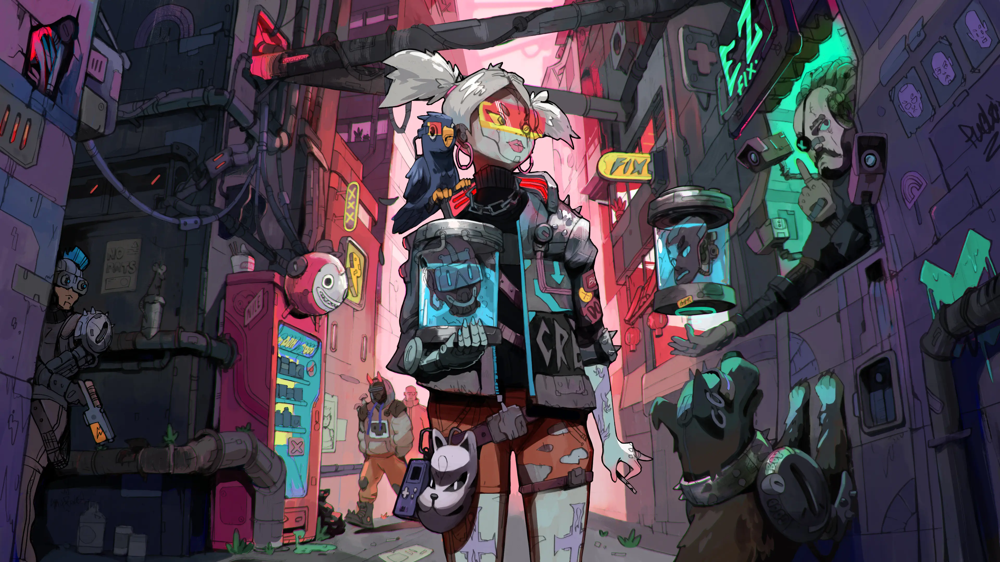

### Hi  👋

  

- 🔭 I'm **Rodrick**

- 🦾 **Cyberpunk**

- 🌱 I’m currently learning  **Javascript-Algorithms Vue React**

- 💬 Ask me about anything, I am happy to help

- 🌐 Visit my **[blog](https://rodrick.cn/)**

  

 
 

